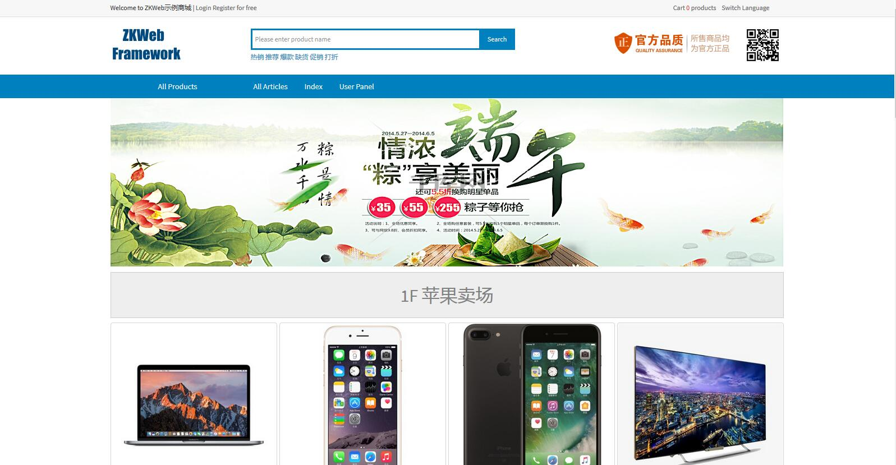
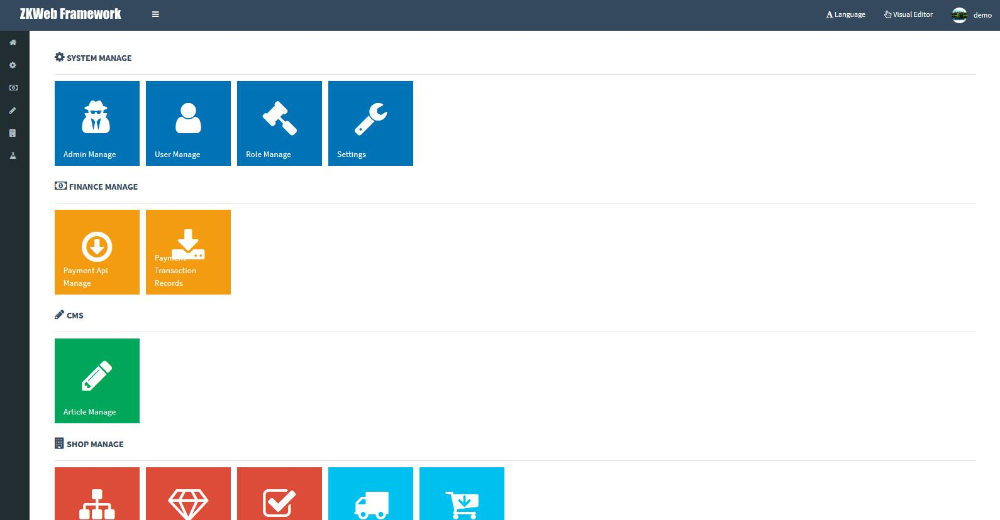
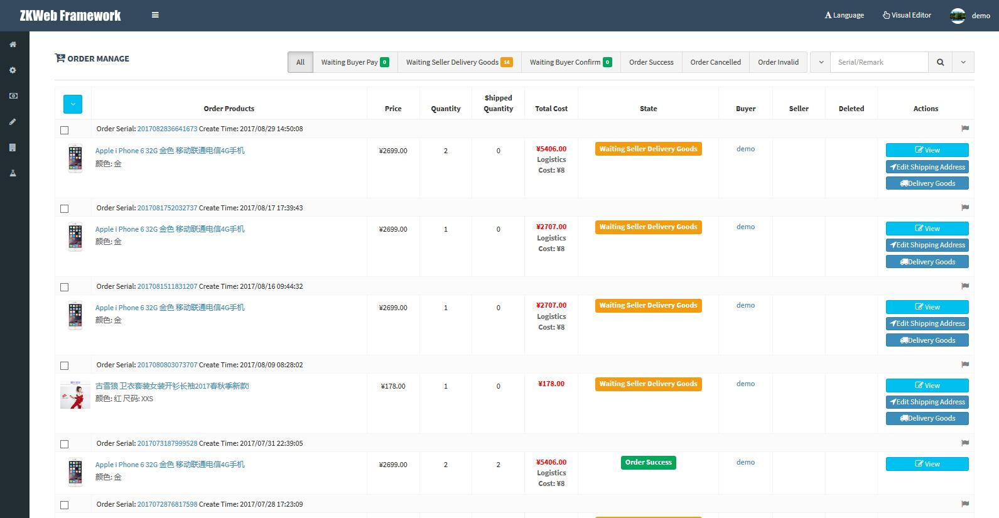

# MPA demo plugins for zkweb framework  

This repository only contains plugins, if you want to run it please do either:

Use project creator from [ZKWeb](https://github.com/zkweb-framework/ZKWeb), select 'src\ZKWeb.Plugins\plugin.collection.json' as default plugin collection.

Or, run it from the [ZKWeb.Demo](https://github.com/zkweb-framework/ZKWeb.Demo) project.

# Screenshots

# LICENSE

MIT License 
Copyright © 2016~2017 303248153@github 
If you have any license issue please contact 303248153@qq.com.

# Plugins informations: 

**Directory Name **|**Name **|**Version **|**Full Version **|**Description**
:-----:|:-----:|:-----:|:-----:|:-----:
Common.Base |Base Functions |2.0.0 |2.0.0 |Base functions and template pages
Common.Captcha |Captcha |2.0.0 |2.0.0 |Provide captcha form field and validation
Common.Admin |Admin Panel |2.0.0 |2.0.0 |Admin panel and users management
Common.MenuPage |Menu Page Functions |2.0.0 |2.0.0 |Functions for building menu page
Common.AdminSettings |Admin Settings |2.0.0 |2.0.0 |Centralized management for admin settings
Common.UserPanel |User Panel |2.0.0 |2.0.0 |Pages for user panel
Common.UserContact |User Contact |2.0.0 |2.0.0 |Manage contact information for users
Common.GenericClass |Generic Class |2.0.0 |2.0.0 |Generic class/catalog management
Common.GenericTag |Generic Tag |2.0.0 |2.0.0 |Generic tag management
Common.GenericRecord |Generic Record |2.0.0 |2.0.0 |Generic records management
Common.LanguageSwitcher |Language Switcher |2.0.0 |2.0.0 |Provide manually language switch menu for visitor
Common.Currency |Currency |2.0.0 |2.0.0 |Provide currency types and related functions
Common.PesudoStatic |Pesudo Static |2.0.0 |2.0.0 |Pesudo static support
Common.QRCoder |QRCoder |2.0.0 |2.0.0 |Support generate QRCode
Common.Region |Region |2.0.0 |2.0.0 |Provide regions and related functions
Common.SerialGenerate |Serial Generate |2.0.0 |2.0.0 |Support serial generation
Common.CodeEditor |Code Editor |2.0.0 |2.0.0 |Provide code editor form field
Common.Datepicker |Datepicker form field |2.0.0 |2.0.0 |Provide form field for choose date or date range
Common.DynamicForm |Dynamic Form |2.0.0 |2.0.0 |Support build dynamic form from json data
Common.DynamicForm.CodeEditor |Dynamic Code Editor |2.0.0 |2.0.0 |Dynamic form field for code editor
Common.DynamicForm.DatePicker |Dynamic Date Picker |2.0.0 |2.0.0 |Dynamic form field for date picker
Finance.Payment |Payment Api |2.0.0 |2.0.0 |Support receive money through payment api
Finance.Payment.Alipay |Alipay Payment Api |2.0.0 |2.0.0 |Support pay transactions by alipay
Finance.Payment.AlipayMobile |Alipay Mobile Payment Api |2.0.0 |2.0.0 |Support pay transactions by alipay mobile
Finance.Payment.Cash |Cash Payment Api |0.0.0 |0.0.0 |Support pay transactions by cash
Finance.Payment.OnArrive |On Arrive Payment Api |0.0.0 |0.0.0 |Support pay transactions on goods arrive
Finance.Payment.Pingpp |Pingpp Payment Api |2.0.0 |2.0.0 |Support pay transactions by pingpp
Finance.Payment.Tenpay |Tenpay Payment Api |0.0.0 |0.0.0 |Support pay transactions by tenpay
Finance.Payment.WeChat |Wechat Payment Api |2.0.0 |2.0.0 |Support pay transactions by wechat
CMS.CKEditor |CKEditor |2.0.0 |2.0.0 |Provide ckeditor form field
CMS.ImageBrowser |Image Browser |2.0.0 |2.0.0 |Provide image browse and upload functions
CMS.Article |Article |2.0.0 |2.0.0 |Article management and display
Shopping.Product |Product |2.0.0 |2.0.0 |Product management for ec site
Shopping.Logistics |Logistics |2.0.0 |2.0.0 |Logistics management for ec site
Shopping.Order |Order |2.0.0 |2.0.0 |Order management for ec site
Shopping.ProductBookmark |Product Bookmark |2.0.0 |2.0.0 |Product bookmark feature for ec site
Shopping.ProductRating |Product Rating |2.0.0 |2.0.0 |Order product rating feature for ec site
Shopping.AfterSales |After Sales |0.0.0 |0.0.0 |After Sales management for ec site
Testing.WebTester |Web Tester |2.0.0 |2.0.0 |Support running tests from admin panel
Theme.Mobile.Frame |Mobile Frame |2.0.0 |2.0.0 |Mobile optimized page frame theme
Theme.VisualEditor |Visual Theme Editor |2.0.0 |2.0.0 |Allow edit website theme visually
Theme.Widgets.Base |Base Template Widgets |2.0.0 |2.0.0 |Base template widgets
Theme.Widgets.Product |Product Template Widgets |2.0.0 |2.0.0 |Product template widgets
Theme.Widgets.QRCode |QRCode Template Widgets |2.0.0 |2.0.0 |QRCode template widgets
Theme.Widgets.Slideshow |Slideshow Template Widgets |2.0.0 |2.0.0 |Slideshow template widgets
Common.CustomTranslate |Custom Translate |2.0.0 |2.0.0 |Support custom translate through admin panel 

(Thanks [Tables Generator](http://www.tablesgenerator.com/markdown_tables))
(Also thanks [Markdown-Table-Generator](https://github.com/jakebathman/Markdown-Table-Generator))
